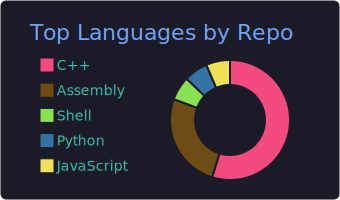

<!-- This file is generated from .github/README.src.md by GitHub Actions. Do not edit directly. -->

I build small, fast, low-dependency tools with a focus on performance and simple operation. \
For narrow utilities, I use C, C++, or Assembly when low runtime cost and a small deployment footprint matter.

<!-- badges:auto:start -->
<table>
  <tr>
    <td valign="top" width="310">
      
    </td>
    <td valign="top">
      <b>Languages</b> 
      
      
      
      
      
      
      
       
      <b>Backend / Web</b> 
      
      
      
      
      
      
      
       
      <b>Tooling / Environment</b> 
      
      
      
      
      
      
      
    </td>
  </tr>
</table>
<!-- badges:auto:end -->

<!-- projects:auto:start -->
- [karing](https://github.com/recelsus/karing) - A simple C++ server app, like pastebin.
- [Roche-Limit](https://github.com/recelsus/Roche-Limit) - C++20 authorization server and CLI, using SQLite IP and API key rules.
- [lanc](https://github.com/recelsus/lanc) - Minimal single-file text editor for constrained Unix-like environments.
- [sfil](https://github.com/recelsus/sfil) - Small CLI tool to temporarily serve a local file over HTTP.
- [Spagyrist](https://github.com/recelsus/libspagyrist) - C++ library for search candidate selection, document modeling, rendering, and output.
<!-- projects:auto:end -->
